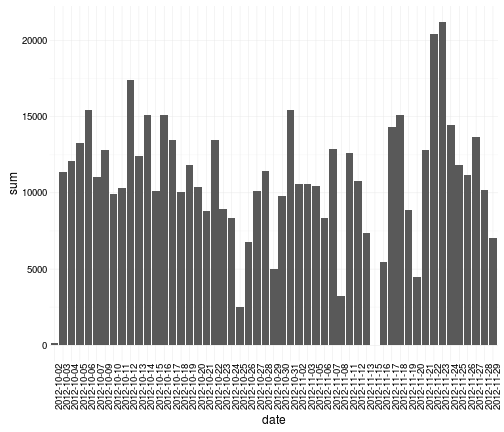
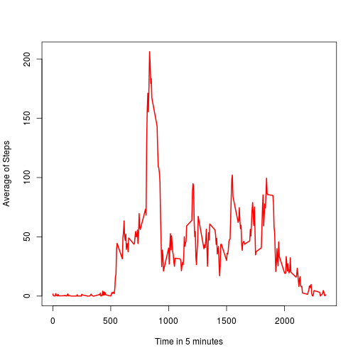
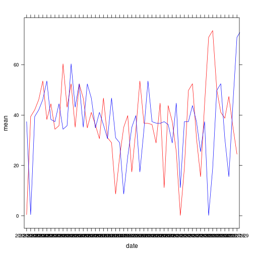
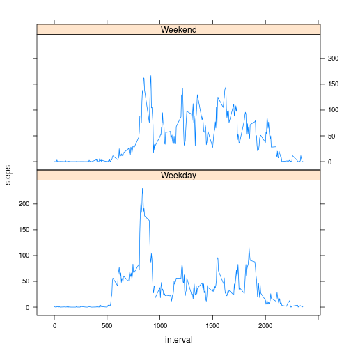

It is now possible to collect a large amount of data about personal movement using activity monitoring devices such as a Fitbit, Nike Fuelband, or Jawbone Up. These type of devices are part of the “quantified self” movement – a group of enthusiasts who take measurements about themselves regularly to improve their health, to find patterns in their behavior, or because they are tech geeks. But these data remain under-utilized both because the raw data are hard to obtain and there is a lack of statistical methods and software for processing and interpreting the data


```{r}
library(ggplot2)
# https://d396qusza40orc.cloudfront.net/repdata%2Fdata%2Factivity.zip
activity <- read.csv("activity.csv")
#Complete cases
activityCases <- activity[complete.cases(activity),]
## Data table and by date
aT <- data.table(activityCases, key = "date")
pT <- aT[, date := date ][, list(sum = sum(steps)), by = "date"]
```


## 1. Histogram of the total number of steps taken each day
```{r}
ggplot(pT, aes(x=date, y=sum)) + geom_bar(stat="identity") + theme_bw() + theme_minimal() + theme(axis.text.x = element_text(angle=90, hjust=1))
```



## Mean and Median number of steps taken each da
```{r}
summary(activityCases$steps)
pT <- aT[, date := date ][, list(sum = sum(steps), mean = mean(steps), median = (median(steps))), by = "date"]
head(pT)
```


## Average Daily activity pattern
```{r}
activity$DataTime <- seq.POSIXt(as.POSIXct(activity$date[1]), length =nrow(activity) ,by = "5 min")

#Sort the data for 5 minute interval
options(warn = -1)
activity.x <- subset(activityCases, select = -interval)
activity.s <- subset(activityCases, select = interval)
sT <- aggregate(activity.x, activity.s, mean)
summary(sT$steps)
```

#Plot
```{r plot}
plot(sT$interval, sT$steps, type="l", xlab = "Time in 5 minutes", ylab = "Average of Steps",col = "red", lwd=2)
```



## Maximum steps for the 5 minute period
```{r}
sT[which(grepl(max(sT$steps),sT$steps)),c(1)]
```


```{r}
## Imputing Missing values

print("Total NA's which are missing values in dataset")
nrow(activity[!complete.cases(activity),])

print("Fill in the missing values with mean calculated for the steps for the 5 minute interval")

activityEdited <- activity
for(i in 1:nrow(activityEdited)) {
  if(!complete.cases(activityEdited[i,])) {
    if(is.na(activityEdited[i,]$steps)){
      activityEdited[i,1] = subset(sT, interval %in% activityEdited[i,]$interval )$steps
      
    }
  }
}
```


## Histogram with imputed data
```{r}
#Without imputing data
pT <- aT[, date := date ][, list(sum = sum(steps), mean = mean(steps), median = as.integer(median(steps)) ), by = "date"]

#With imputed data
eT <- data.table(activityEdited, key = "date")
kT <- eT[, date := date ][, list(sum = sum(steps), mean = mean(steps), median = median(steps)), by = "date"]

#Plot the 2 data
library(latticeExtra)
xyplot(mean ~ date, data = pT, type="l",col="red") + xyplot(mean ~ date, data = kT, type="l",col="blue") 
```



### Make a histogram of the total number of steps taken each day and Calculate and report the mean and median total number of steps taken per day. Do these values differ from the estimates from the first part of the assignment? What is the impact of imputing missing data on the estimates of the total daily number of steps?
```{r}
summary(eT$steps)
nrow(mT)
summary(sT$steps)
nrow(sT)
```


## Difference between weekdays and weekdays activity pattern
```{r}
activityWeekdays <- activityEdited
for(i in 1:nrow(activityWeekdays)) {
  if(weekdays(activityWeekdays[i,]$DataTime) %in% c("Saturday","Sunday")) {
    activityWeekdays[i,5] = "Weekend"
  } else {
    activityWeekdays[i,5] = "Weekday"
  }
  
}
head(activityWeekdays)
weekdaySet <- subset(activityWeekdays, V5 %in% "Weekday")
weekdayEnd <- subset(activityWeekdays, V5 %in% "Weekend")

# Weekday avergae
activity.x <- subset(weekdaySet, select = -interval)
activity.s <- subset(weekdaySet, select = interval)
wT <- aggregate(activity.x, activity.s, mean)
wT[1:nrow(wT),5] = "Weekday"

# Weekend set
activity.x <- subset(weekdayEnd, select = -interval)
activity.s <- subset(weekdayEnd, select = interval)
pT <- aggregate(activity.x, activity.s, mean)
pT[1:nrow(pT),5] = "Weekend"

#install.packages("dplyr")
library("plyr")
```

```{r}
xyplot(steps ~ interval | factor(V5), data = plyr::join(wT, pT, type="full"), type = "l", layout=c(1,2))
```
